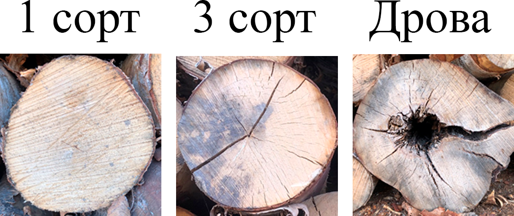
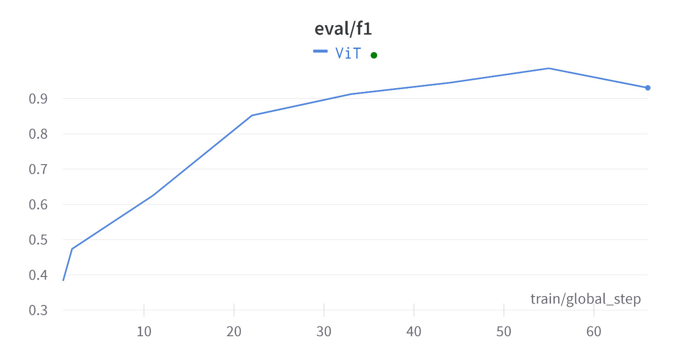
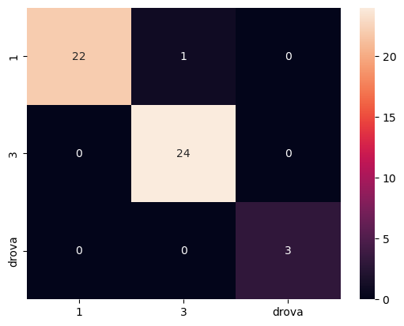
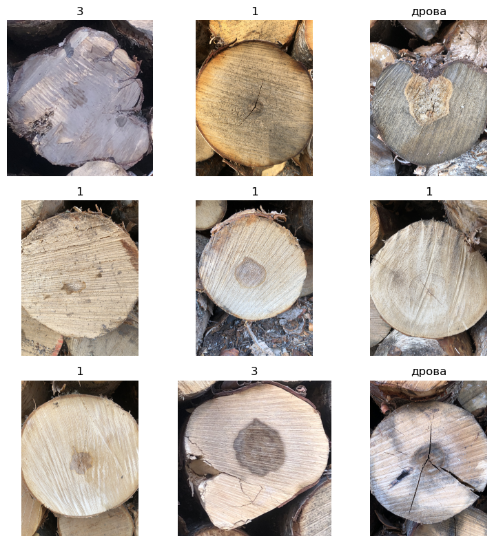

# Выпускная квалификационная работа по программе цифровой кафедры РТУ МИРЭА

## Постановка задачи
Обучить нейронную сеть для классификации изображений, содержащих спилы бревен, по трем категориям сортности:
- 1 и 2 сорт
- 3 сорт
- дрова

Примеры показаны на изображении ниже

## Решение
### ViT
Лучшим решением поставленной задачи является дообучение визуального трансформера на имеющемся наборе данных.

### Валидация результатов
График изменения метрики F1-score на валидационной выборке

Матрица ошибок

Пример верно предсказанных классов сортности

